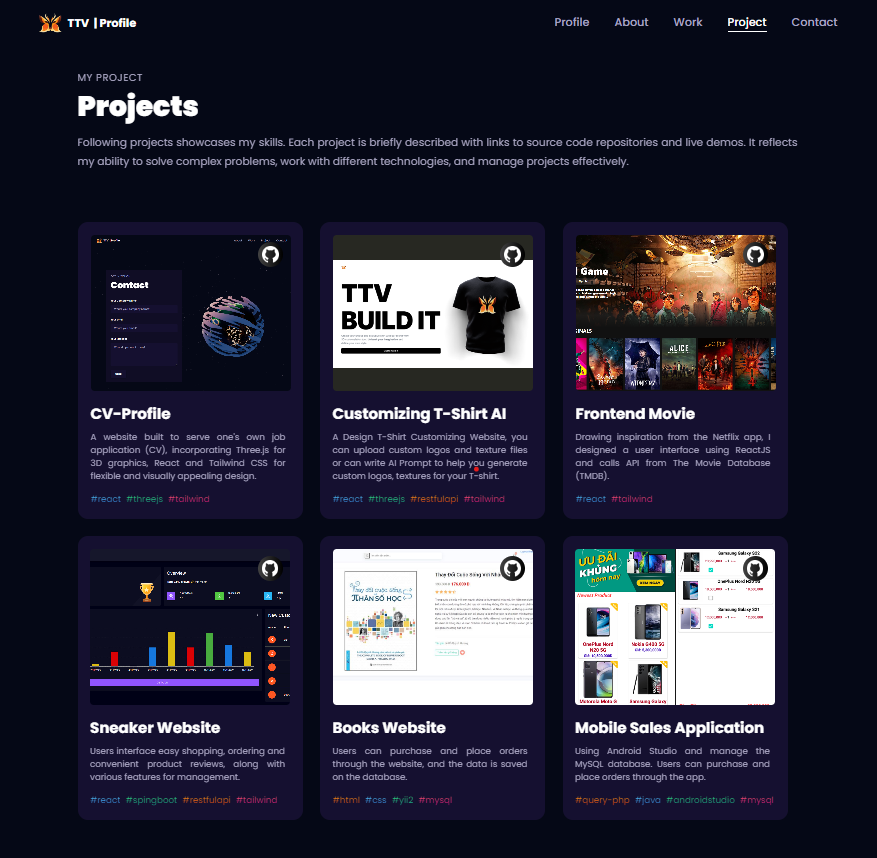
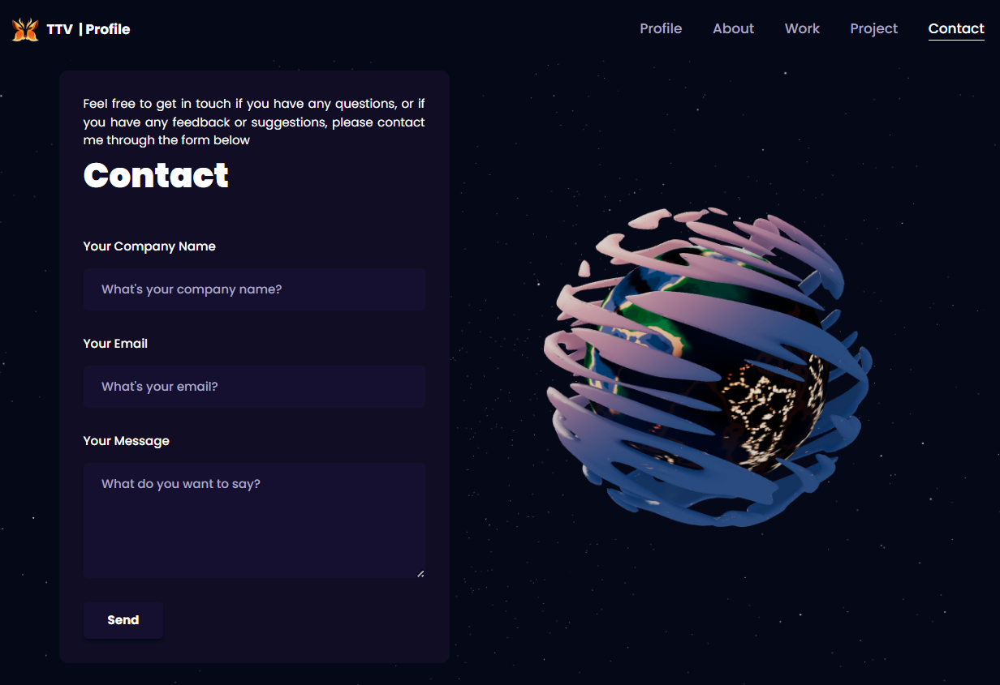

# CV - Profile

# Introduction

- A website built to serve one's own job application (CV)

# My Projects

    

 

# Get in touch

    

# Using

- Vercel: Hosting Services
- Tailwind CSS: Format Style
- React & ThreeJS: Front-End
- Git & Github: Version Control

# Install, Run
- yarn || npm install
- yarn dev || npm run dev

[website]: https://ttv-tranthuyvy-cv.vercel.app/
